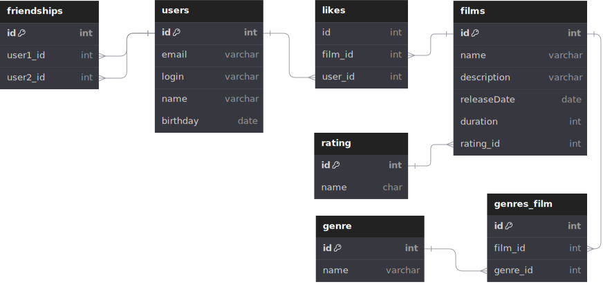

# Filmorate


### Описание БД
База данных веб-приложения Filmorate, где пользователи делятся оценками фильмов и могут найти друзей.

БД состоит из следующих таблиц:

***users*** - таблица с данными пользователей

***films*** - данные фильмов

***genres*** - таблица-словарь с названиями жанров фильмов

***genres_film*** - промежуточная таблица для связи многие-ко-многим. Такая реализация нужна на случай, если фильм разножанровый

***friendships*** - таблица с данными об установленных дружбах между пользователями.
Имеет два внешних ключа user1_id и user2_id, устанавливающих связи с таблицой users. Если подан запрос на дружбу от пользователя с id = 1 пользователю id = 2, то в таблицу заносится запись: user1_id = 1 и user2_id = 2.
Если запрос подтвержден, дополнительно заносится обратная запись user1_id = 2 и user2_id = 1

***likes*** - таблица хранящая информацию о том, кто и какой фильм оценил

### Примеры запросов для основных операций приложения
___
id подтвержденных друзей пользователя c id = 1
```sql
SELECT user1_id
FROM friendships
WHERE user2_id = 1 AND user1_id IN(
SELECT user2_id
FROM friendships
WHERE user1_id = 1);
```

id неподтвержденных друзей пользователя c id = 1
```sql
SELECT user1_id
FROM friendships
WHERE user2_id = 1 AND user1_id NOT IN(
SELECT user2_id
FROM friendships
WHERE user1_id = 1);
```
Все друзья пользователя с id = 1(и подтвержденные и не подтвержденные)
```sql
SELECT user1_id
FROM friendships
WHERE user2_id = 1
UNION
SELECT user2_id
FROM friendships
WHERE user1_id = 1;
```
Общие друзья пользователей id = 1 и id = 2
```sql
SELECT user1_id 
FROM friendships 
WHERE user2_id = 1 AND user1_id IN(
SELECT user1_id 
FROM friendships 
WHERE user2_id = 2)
UNION
SELECT user2_id 
FROM friendships 
WHERE user1_id = 1 AND user2_id IN(
SELECT user2_id 
FROM friendships 
WHERE user1_id = 2)
```
TOP 10 фильмов по лайкам
```sql
SELECT f.id, 
        COUNT(l.film_id) AS likes_count
FROM films AS f
INNER JOIN likes AS l ON f.id = l.film_id
GROUP BY f.id
ORDER BY likes_count DESC
LIMIT 10;
```